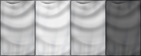

# Darkest-Hour_Flagmaker
## A Python script that makes flag graphics for Darkest Hour and other old Paradox Interactive games.

To run you must have some version of Python 3 and PIL or Python Imaging Library for short,

- to install PIL run your cmd and then type in cd "[YOUR PYTHON FOLDER PATH]"python pip -m install PIP

- after that create a batch file or run this through your cmd: 

	- cd "[Where ever this folder is]"

	- "[YOUR PYTHON FOLDER PATH]\python.exe" Flagmaker.py

- Put the flag files you want in the input folder with the 3 letter **TAG** as the file name!

If you have a dark flag I recommend increasing the brightness; using luminosity curves preferably, for best results.

The program should then resize and work on the flags using PIL putting the shields in output/shields and the animated flags in output/flags

I've included 4 shield styles:

")

Hearts of Iron 2, Darkest Hour FULL, EU3 complete(based on the forum avatars), and Victoria 1.

To use these just rename the shield files to Shield_Blank.png and Shield_SCREEN.png, if you don't want to use screen just use a blank png.

Enjoy!!
